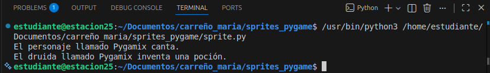
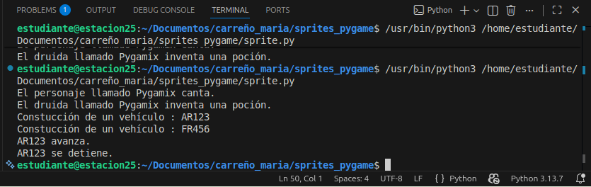
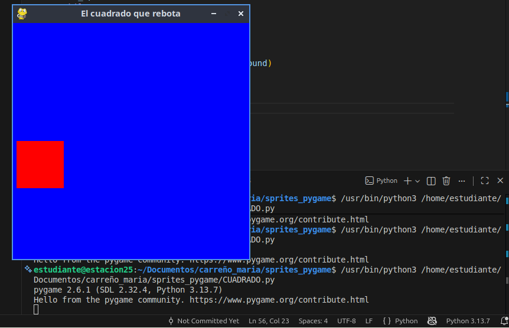

# Guía Básica: POO y Sprites en Pygame
## 1. Conceptos en 4 Puntos
## Clase:
 Es el molde (ej. Molde de Galletas)

## Objeto:
 Es el producto real hecho con el molde (ej. La galleta)

## Herencia:
 Cuando una clase "hija" hereda funciones de una "padre" para no repetir código

## Sprite: 
Una "imagen-objeto" que sabe su posición y cómo moverse en la pantalla (usando pygame).

## 2. Código 1: Herencia en Python (POO)
Este código muestra cómo crear un personaje y un druida que hereda sus dotes.
# Definimos la clase base
    ´´´Python
class Personaje:
    def __init__(self): # Inicializador de la clase
        self.NOMBRE = "Genérico" # Atributo: nombre

    def Cantar(self): # Método: acción de cantar
        print(self.NOMBRE + " está cantando...") # Muestra mensaje en consola

# Druida hereda de Personaje
class Druida(Personaje):
    def __init__(self, nombre): # Recibe un nombre al crearse
        self.NOMBRE = nombre # Guarda el nombre en el objeto

    def Pocion(self): # Método único del Druida
        print(self.NOMBRE + " crea una poción mágica.")

#  PRUEBA 
mago = Druida("Pygamix") # Crea el objeto en memoria
mago.Cantar() # Usa el método heredado [3]
mago.Pocion() # Usa su propio método [3]

## 3. Código 2: Cuadrado Móvil (Pygame)
´´´python
Este código abre una ventana con un cuadrado rojo que rebota solo

import pygame, sys # Importa las librerías necesarias

# Clase que crea un cuadrado que sabe rebotar
class CUADRADO(pygame.sprite.Sprite):
    def __init__(self):
        pygame.sprite.Sprite.__init__(self) # Inicia la base de Sprite [6]
        self.image = pygame.Surface((50, 50)) # Crea el dibujo (50x50 px) [7]
        self.image.fill((255, 0, 0)) # Lo pinta de color ROJO
        self.rect = self.image.get_rect() # Crea su rectángulo de posición [7]
        self.rect.x, self.rect.y = 100, 100 # Posición inicial
        self.vel = 5 # Velocidad de movimiento

    def update(self): # Se ejecuta en cada frame [8]
        self.rect.x += self.vel # Mueve el cuadrado
        if self.rect.x >= 350 or self.rect.x <= 0: # Detecta bordes [7]
            self.vel *= -1 # Invierte dirección si choca

# CONFIGURACIÓN 
pygame.init() # Inicia Pygame
ventana = pygame.display.set_mode((400, 400)) # Crea ventana de 400x400
grupo = pygame.sprite.Group() # Crea grupo para manejar sprites [5]
cuadrito = CUADRADO() # Crea la instancia del cuadrado
grupo.add(cuadrito) # Agrega el cuadrado al grupo [9]

# BUCLE DEL JUEGO 
while True:
    for e in pygame.event.get(): # Revisa si cierras la ventana
        if e.type == pygame.QUIT: sys.exit()

    ventana.fill((0, 0, 255)) # Pinta el fondo de AZUL
    grupo.update() # Llama automáticamente al movimiento [9]
    grupo.draw(ventana) # Dibuja el cuadrado en su nueva posición [9]
    pygame.display.flip() # Actualiza lo que vemos en pantalla

## 3. ¿Qué pasa en la Memoria?
- Cuando ejecutas el código de Pygame, ocurre lo siguiente:
El Objeto en RAM: Se crea un bloque de datos llamado cuadrito que guarda su posición (X, Y) y su imagen

- El Grupo: grupo actúa como una lista que contiene una flecha (referencia) apuntando a cuadrito para darle órdenes masivas

- Resultado Gráfico: Verás una caja roja moviéndose de lado a lado sobre un fondo azul, rebotando infinitamente al tocar los bordes de la ventana de 400px.

## Esquema de Memoria:

Clase CUADRADO: El plano técnico.
Instancia cuadrito: El objeto vivo con datos reales (rect.x, vel).
Variable ventana: El espacio físico donde se renderizan los píxeles.

# Foto final del resultado
## trabajo de la ejecucion de la clase persona 

## trabajo del vehícilo en pygame 

## TRABAJO FINAL: el cuadrado rebotando en la ventana de pygame
